# AVIAN Cybersecurity Platform Design

## Overview

The AVIAN platform is designed as a modern, scalable cybersecurity operations platform with a multi-tenant architecture. The system emphasizes security, performance, and user experience while providing comprehensive incident management, compliance tracking, and alert management capabilities. Additionally, AVIAN includes a deployable agent system for automated client onboarding, asset management, and enhanced data collection.

### Key Design Principles

- **Security First**: Multi-tenant isolation, role-based access control, and comprehensive audit logging
- **Modern UX**: Clean, intuitive interface with dark/light mode support and responsive design
- **Scalability**: Containerized microservices architecture with horizontal scaling capabilities
- **Integration Ready**: RESTful APIs and webhook support for external system integration
- **Agent-Based Monitoring**: Deployable agents for comprehensive asset management and data collection
- **Deployment Flexibility**: Support for both cloud and on-premises deployments

## Architecture

### High-Level Architecture

```mermaid
graph TB
    subgraph "Frontend Layer"
        UI[React/Next.js UI]
        PWA[Progressive Web App]
    end
    
    subgraph "API Gateway"
        Gateway[API Gateway/Load Balancer]
        Auth[Authentication Service]
    end
    
    subgraph "Application Services"
        UserMgmt[User Management Service]
        TenantMgmt[Tenant Management Service]
        TicketMgmt[Ticket Management Service]
        AlertMgmt[Alert Management Service]
        ComplianceMgmt[Compliance Service]
        NotificationSvc[Notification Service]
        ReportingSvc[Reporting Service]
        AgentMgmt[Agent Management Service]
        AssetMgmt[Asset Management Service]
        DataIngestion[Data Ingestion Service]
        ThreatLakeMgmt[Threat Lake Management]
        DocumentAnalysis[Document Analysis Service]
        PlaybookMgmt[Security Playbook Service]
    end
    
    subgraph "Data Layer"
        MainDB[(PostgreSQL - Main DB)]
        TenantDB1[(Tenant 1 Schema)]
        TenantDB2[(Tenant 2 Schema)]
        Redis[(Redis Cache)]
        FileStore[File Storage]
    end
    
    subgraph "Data Sources"
        EDR1[Avast EDR]
        EDR2[Other EDR Systems]
        Firewall1[Firewall 1]
        Firewall2[Firewall 2]
        SIEM[External SIEM Systems]
    end
    
    subgraph "AVIAN Threat Lake"
        ThreatLake[AVIAN Threat Lake]
        DataProcessor[Data Processor]
        Correlator[Event Correlator]
        AlertEngine[Alert Engine]
    end
    
    subgraph "External Services"
        Email[Email Service]
        ExternalThreat[External Threat Intel]
    end
    
    subgraph "AVIAN Agents"
        Agent1[Client Agent 1]
        Agent2[Client Agent 2]
        AgentN[Client Agent N]
    end
    
    UI --> Gateway
    PWA --> Gateway
    Gateway --> Auth
    Gateway --> UserMgmt
    Gateway --> TenantMgmt
    Gateway --> TicketMgmt
    Gateway --> AlertMgmt
    Gateway --> ComplianceMgmt
    Gateway --> NotificationSvc
    Gateway --> ReportingSvc
    Gateway --> AgentMgmt
    Gateway --> AssetMgmt
    Gateway --> DataIngestion
    Gateway --> ThreatLakeMgmt
    Gateway --> DocumentAnalysis
    Gateway --> PlaybookMgmt
    
    UserMgmt --> MainDB
    TenantMgmt --> MainDB
    TicketMgmt --> TenantDB1
    TicketMgmt --> TenantDB2
    AlertMgmt --> TenantDB1
    AlertMgmt --> TenantDB2
    ComplianceMgmt --> TenantDB1
    ComplianceMgmt --> TenantDB2
    DocumentAnalysis --> ComplianceMgmt
    
    NotificationSvc --> Email
    ReportingSvc --> FileStore
    
    EDR1 --> DataIngestion
    EDR2 --> DataIngestion
    Firewall1 --> DataIngestion
    Firewall2 --> DataIngestion
    SIEM --> DataIngestion
    
    DataIngestion --> DataProcessor
    DataProcessor --> ThreatLake
    DataProcessor --> Correlator
    Correlator --> AlertEngine
    AlertEngine --> AlertMgmt
    
    ThreatLakeMgmt --> ThreatLake
    ReportingSvc --> ThreatLake
    
    Agent1 --> Gateway
    Agent2 --> Gateway
    AgentN --> Gateway
    
    UserMgmt --> Redis
    Auth --> Redis
```



### Technology Stack

**Frontend:**
- React 18+ with Next.js 14 for SSR and performance
- TypeScript for type safety
- Tailwind CSS for styling with custom design system
- Recharts/Chart.js for data visualization
- React Query for state management and caching
- Socket.io for real-time updates

**Backend:**
- Node.js with Express.js or Fastify
- TypeScript for consistency
- PostgreSQL for primary data storage
- Redis for caching and session management
- Docker containers for deployment
- JWT for authentication with refresh tokens

**Infrastructure:**
- Kubernetes for orchestration
- NGINX for load balancing and reverse proxy
- Prometheus + Grafana for monitoring
- ELK Stack for logging
- MinIO or AWS S3 for file storage

## Components and Interfaces

### Core Components

#### 1. Authentication & Authorization Service

**Purpose**: Enforces mandatory authentication and MFA for all users before platform access

**Authentication Flow:**
1. **Initial Login**: User provides email/password credentials
2. **MFA Check**: System verifies MFA setup status
3. **MFA Setup** (if not completed): Force user through TOTP setup with QR code
4. **MFA Verification**: User provides TOTP code from authenticator app
5. **Access Granted**: JWT tokens issued after successful MFA verification
6. **Session Management**: Continuous session validation with Redis

**MFA Implementation:**
- **TOTP Algorithm**: RFC 6238 compliant Time-based One-Time Password
- **Supported Apps**: Google Authenticator, Authy, Microsoft Authenticator, 1Password
- **Backup Codes**: 10 single-use recovery codes generated during setup
- **QR Code Generation**: Automatic QR code for easy authenticator app setup

**Key Features:**
- Mandatory authentication for all platform access
- JWT-based authentication with refresh tokens
- Mandatory MFA for all users (TOTP-based with authenticator apps)
- Forced MFA setup during account creation and first login
- Role-based permissions (Super Admin, Tenant Admin, Security Analyst, IT Helpdesk Analyst, User)
- Session management with Redis
- Comprehensive audit logging for all authentication events

**API Endpoints:**
```typescript
POST /auth/login
POST /auth/logout
POST /auth/refresh
POST /auth/mfa/setup          // Mandatory during account creation
POST /auth/mfa/verify         // Required for all logins
POST /auth/mfa/regenerate     // Generate new backup codes
GET /auth/mfa/status          // Check MFA setup status
GET /auth/profile
PUT /auth/profile
GET /auth/check               // Verify authentication status
```

#### 2. Tenant Management Service

**Purpose**: Manages multi-tenant isolation and tenant-specific configurations

**Key Features:**
- Tenant creation and configuration
- Database schema isolation per tenant
- Tenant-specific branding and settings
- Usage metrics and analytics
- Tenant user management

**API Endpoints:**
```typescript
POST /tenants
GET /tenants
GET /tenants/:id
PUT /tenants/:id
DELETE /tenants/:id
GET /tenants/:id/users
GET /tenants/:id/metrics
```

#### 3. User Management Service

**Purpose**: Manages user accounts, roles, and permissions within tenants

**Key Features:**
- User CRUD operations
- Role assignment and management (Super Admin, Tenant Admin, Security Analyst, IT Helpdesk Analyst, User)
- Role-based permission validation and access control
- User activity tracking with role-specific audit logs
- Bulk user operations with role restrictions

**API Endpoints:**
```typescript
POST /users
GET /users
GET /users/:id
PUT /users/:id
DELETE /users/:id
PUT /users/:id/role
GET /users/:id/permissions
```

#### 4. Dashboard Service

**Purpose**: Aggregates and serves role-based dashboard data for analysts

**Key Features:**
- Real-time metrics aggregation with role-based filtering
- Role-specific widget configuration management
- Performance optimization with caching
- Customizable dashboard layouts per role
- Export capabilities with role-appropriate data

**API Endpoints:**
```typescript
GET /dashboard/overview
GET /dashboard/widgets
PUT /dashboard/widgets
GET /dashboard/metrics
GET /dashboard/alerts/recent  // Security Analysts only
GET /dashboard/tickets/summary
GET /dashboard/tickets/my     // Personal ticket queue
```

#### 5. Ticket Management Service

**Purpose**: Handles security incident tickets and workflow management

**Key Features:**
- Ticket lifecycle management (New → Closed)
- Role-based ticket access control (Security vs IT categories)
- Field-level access control (title/description locked to creator)
- SLA tracking and notifications
- Comment and attachment support
- Escalation workflows within role boundaries
- Advanced search and filtering with role restrictions

**Data Model:**
```typescript
interface Ticket {
  id: string;
  tenant_id: string;
  requester: string;
  assignee: string;
  title: string;
  description: string;
  category: TicketCategory;
  severity: TicketSeverity;
  priority: TicketPriority;
  status: TicketStatus;
  tags: string[];
  sla_deadline: Date;
  created_by: string; // User ID of ticket creator for field access control
  created_at: Date;
  updated_at: Date;
  comments: Comment[];
  attachments: Attachment[];
}
```

**API Endpoints:**
```typescript
POST /tickets
GET /tickets                    // All tickets within role permissions
GET /tickets/my                 // Personal assigned tickets
GET /tickets/:id
PUT /tickets/:id
DELETE /tickets/:id
POST /tickets/:id/comments
GET /tickets/:id/comments
POST /tickets/:id/attachments
GET /tickets/security          // Security Analysts only
GET /tickets/it-support        // IT Helpdesk Analysts only
```

#### 6. Alert Management Service

**Purpose**: Processes and manages security alerts from various sources

**Key Features:**
- Alert ingestion from multiple sources
- Severity classification and filtering
- Alert-to-ticket automation (Security Analysts only)
- Real-time alert streaming (Security Analysts only)
- Alert correlation and deduplication
- Role-based access control (Security Analysts only)

**Data Model:**
```typescript
interface Alert {
  id: string;
  tenant_id: string;
  source: string;
  title: string;
  description: string;
  severity: AlertSeverity;
  category: AlertCategory;
  status: AlertStatus;
  metadata: Record<string, any>;
  created_at: Date;
  updated_at: Date;
}
```

**API Endpoints:**
```typescript
POST /alerts
GET /alerts
GET /alerts/:id
PUT /alerts/:id/status
POST /alerts/bulk
GET /alerts/stream (WebSocket)
```

#### 7. Compliance Management Service

**Purpose**: Tracks compliance against multiple frameworks and generates reports

**Key Features:**
- Multi-framework support (HIPAA, ISO, PCI, Custom)
- Automated compliance assessment using agent and EDR data
- Manual compliance control verification workflows
- Hybrid compliance scoring algorithms (automated + manual)
- Evidence attachment and validation
- Real-time compliance monitoring and alerting

**Data Model:**
```typescript
interface ComplianceFramework {
  id: string;
  name: string;
  version: string;
  controls: ComplianceControl[];
}

interface ComplianceControl {
  id: string;
  framework_id: string;
  title: string;
  description: string;
  control_type: ControlType; // 'automated', 'manual', 'hybrid'
  automated_status: AutomatedComplianceStatus;
  manual_status: ManualComplianceStatus;
  overall_status: ComplianceStatus;
  weight: number; // For scoring calculations
  evidence: Evidence[];
  automated_checks: AutomatedCheck[];
  last_automated_assessment: Date;
  last_manual_review: Date;
  reviewer: string;
}

interface AutomatedCheck {
  id: string;
  check_type: string; // 'agent_policy', 'edr_config', 'asset_inventory', 'security_tool', 'document_analysis'
  data_source: string;
  query: string;
  expected_result: any;
  actual_result: any;
  status: 'pass' | 'fail' | 'warning';
  confidence_score?: number; // For AI-based checks
  last_checked: Date;
}

enum ControlType {
  AUTOMATED = 'automated',     // Fully automated assessment (technical controls)
  AI_ASSISTED = 'ai_assisted', // AI analysis with human validation (document reviews)
  MANUAL = 'manual',          // Requires human verification (physical security)
  HYBRID = 'hybrid'           // Combination of multiple approaches
}

interface ComplianceScore {
  framework_id: string;
  tenant_id: string;
  overall_score: number;      // 0-100 percentage
  automated_score: number;    // Score from automated checks
  manual_score: number;       // Score from manual reviews
  total_controls: number;
  automated_controls: number;
  manual_controls: number;
  passed_controls: number;
  failed_controls: number;
  pending_controls: number;
  last_calculated: Date;
}
```

**API Endpoints:**
```typescript
GET /compliance/frameworks
GET /compliance/frameworks/:id
PUT /compliance/controls/:id
POST /compliance/controls/:id/evidence
POST /compliance/controls/:id/manual-review
GET /compliance/controls/:id/automated-checks
POST /compliance/automated-assessment
GET /compliance/scores
GET /compliance/scores/:frameworkId
GET /compliance/reports
POST /compliance/reports/generate
```

#### 8. Notification Service

**Purpose**: Manages real-time notifications and email communications

**Key Features:**
- Real-time WebSocket notifications
- Email notification templates
- User notification preferences
- Notification history and tracking
- Bulk notification support

**API Endpoints:**
```typescript
GET /notifications
POST /notifications/mark-read
GET /notifications/preferences
PUT /notifications/preferences
POST /notifications/test
```

#### 9. Agent Management Service

**Purpose**: Manages AVIAN agent deployment, configuration, and communication

**Key Features:**
- Agent deployment and installation automation
- Secure agent-to-platform communication
- Agent configuration management and updates
- Agent health monitoring and status tracking
- EDR and security tool installation coordination

**Data Model:**
```typescript
interface Agent {
  id: string;
  tenant_id: string;
  client_id: string;
  hostname: string;
  ip_address: string;
  os_type: string;
  os_version: string;
  agent_version: string;
  status: AgentStatus;
  last_heartbeat: Date;
  installed_tools: InstalledTool[];
  configuration: AgentConfiguration;
  created_at: Date;
  updated_at: Date;
}

interface InstalledTool {
  name: string;
  version: string;
  status: ToolStatus;
  installed_at: Date;
}
```

**API Endpoints:**
```typescript
POST /agents/deploy
GET /agents
GET /agents/:id
PUT /agents/:id/config
POST /agents/:id/install-tool
GET /agents/:id/status
POST /agents/:id/heartbeat
```

#### 10. Asset Management Service

**Purpose**: Manages comprehensive asset inventory and monitoring from AVIAN agents

**Key Features:**
- Real-time asset discovery and inventory
- Asset health monitoring and status tracking
- Software and security tool status management
- Asset-based compliance reporting
- Integration with security alerts and incidents

**Data Model:**
```typescript
interface Asset {
  id: string;
  agent_id: string;
  tenant_id: string;
  asset_type: AssetType;
  name: string;
  description: string;
  ip_address: string;
  mac_address: string;
  os_info: OSInfo;
  hardware_info: HardwareInfo;
  software_inventory: SoftwareItem[];
  security_tools: SecurityTool[];
  compliance_status: ComplianceStatus;
  risk_score: number;
  last_scan: Date;
  created_at: Date;
  updated_at: Date;
}
```

**API Endpoints:**
```typescript
GET /assets
GET /assets/:id
PUT /assets/:id
GET /assets/by-agent/:agentId
GET /assets/inventory
GET /assets/compliance-report
POST /assets/scan
```

#### 11. Data Ingestion Service

**Purpose**: Collects, normalizes, and processes security data from multiple sources

**Key Features:**
- Multi-source data collection (EDR, firewalls, SIEM systems)
- Real-time data ingestion via syslog and API connections
- Data normalization and standardization across different vendors
- Tenant and asset tagging for multi-tenant isolation
- Secure encrypted communication with all data sources

**Data Model:**
```typescript
interface SecurityEvent {
  id: string;
  source_type: DataSourceType;
  source_id: string;
  tenant_id: string;
  asset_id?: string;
  event_type: string;
  severity: EventSeverity;
  timestamp: Date;
  raw_data: Record<string, any>;
  normalized_data: NormalizedEvent;
  tags: string[];
  processed_at: Date;
}

interface DataSource {
  id: string;
  tenant_id: string;
  name: string;
  type: DataSourceType;
  connection_config: ConnectionConfig;
  status: DataSourceStatus;
  last_heartbeat: Date;
  events_processed: number;
}

enum DataSourceType {
  EDR_AVAST = 'edr_avast',
  EDR_CROWDSTRIKE = 'edr_crowdstrike',
  EDR_SENTINELONE = 'edr_sentinelone',
  FIREWALL_PFSENSE = 'firewall_pfsense',
  FIREWALL_FORTINET = 'firewall_fortinet',
  SIEM_SPLUNK = 'siem_splunk',
  SIEM_QRADAR = 'siem_qradar'
}
```

**API Endpoints:**
```typescript
POST /data-sources
GET /data-sources
GET /data-sources/:id
PUT /data-sources/:id
DELETE /data-sources/:id
POST /data-sources/:id/test-connection
GET /data-sources/:id/events
POST /ingest/syslog
POST /ingest/api/:sourceId
GET /events
GET /events/search
```

#### 12. Threat Lake Management Service

**Purpose**: Manages the AVIAN Threat Lake for data storage, correlation, and analysis

**Key Features:**
- Centralized security event storage and indexing
- Real-time event correlation and pattern analysis
- Threat intelligence integration and enrichment
- Advanced analytics and machine learning capabilities
- Data retention and compliance management

**Data Model:**
```typescript
interface ThreatLakeEvent {
  id: string;
  tenant_id: string;
  asset_id?: string;
  event_category: string;
  event_type: string;
  severity: ThreatSeverity;
  confidence_score: number;
  threat_indicators: ThreatIndicator[];
  correlation_id?: string;
  related_events: string[];
  enrichment_data: EnrichmentData;
  timestamp: Date;
  ingested_at: Date;
}

interface CorrelationRule {
  id: string;
  tenant_id: string;
  name: string;
  description: string;
  rule_logic: string;
  severity: ThreatSeverity;
  enabled: boolean;
  created_by: string;
  created_at: Date;
}
```

**API Endpoints:**
```typescript
GET /threat-lake/events
GET /threat-lake/events/search
POST /threat-lake/correlate
GET /threat-lake/correlation-rules
POST /threat-lake/correlation-rules
PUT /threat-lake/correlation-rules/:id
GET /threat-lake/analytics
GET /threat-lake/threat-intel
POST /threat-lake/enrich
```

#### 13. Document Analysis Service

**Purpose**: AI-powered analysis of compliance documents, policies, and procedures

**Key Features:**
- Natural Language Processing (NLP) for document content analysis
- OCR capabilities for scanned document processing
- Automated extraction of compliance-relevant information
- Policy and procedure validation against framework requirements
- Machine learning for continuous improvement of analysis accuracy

**Data Model:**
```typescript
interface DocumentAnalysis {
  id: string;
  document_id: string;
  tenant_id: string;
  framework_id: string;
  analysis_type: AnalysisType;
  content_extracted: string;
  key_findings: KeyFinding[];
  compliance_mappings: ComplianceMapping[];
  confidence_score: number;
  status: AnalysisStatus;
  human_reviewed: boolean;
  reviewer_feedback: ReviewerFeedback;
  analyzed_at: Date;
  reviewed_at?: Date;
}

interface KeyFinding {
  category: string;
  finding: string;
  confidence: number;
  location: DocumentLocation;
  compliance_relevance: string;
}

interface ComplianceMapping {
  control_id: string;
  requirement: string;
  document_section: string;
  compliance_status: 'satisfied' | 'partial' | 'not_satisfied' | 'unclear';
  confidence: number;
  evidence_text: string;
}

enum AnalysisType {
  POLICY_DOCUMENT = 'policy_document',
  PROCEDURE_MANUAL = 'procedure_manual',
  TRAINING_MATERIAL = 'training_material',
  AUDIT_REPORT = 'audit_report',
  RISK_ASSESSMENT = 'risk_assessment'
}
```

**API Endpoints:**
```typescript
POST /documents/upload
POST /documents/:id/analyze
GET /documents/:id/analysis
PUT /documents/:id/analysis/review
GET /documents/analysis/pending-review
POST /documents/batch-analyze
GET /compliance/document-mappings
POST /compliance/validate-document
```

#### 14. Security Playbook Service

**Purpose**: Manages security incident response playbooks and guided response procedures

**Key Features:**
- Predefined playbooks for common security threats and incidents
- Intelligent playbook recommendation based on alert characteristics
- Step-by-step guided response procedures with completion tracking
- Custom playbook creation and modification capabilities
- Integration with incident tickets and alert management

**Data Model:**
```typescript
interface SecurityPlaybook {
  id: string;
  tenant_id: string;
  name: string;
  description: string;
  threat_type: ThreatType;
  severity_level: PlaybookSeverity;
  steps: PlaybookStep[];
  triggers: PlaybookTrigger[];
  estimated_duration: number; // in minutes
  created_by: string;
  last_updated: Date;
  usage_count: number;
  effectiveness_rating: number;
}

interface PlaybookStep {
  id: string;
  step_number: number;
  title: string;
  description: string;
  action_type: StepActionType;
  required: boolean;
  estimated_time: number; // in minutes
  dependencies: string[]; // step IDs that must be completed first
  verification_criteria: string;
}

interface PlaybookExecution {
  id: string;
  playbook_id: string;
  incident_id?: string;
  alert_id?: string;
  executed_by: string;
  started_at: Date;
  completed_at?: Date;
  status: ExecutionStatus;
  completed_steps: CompletedStep[];
  notes: string;
}

enum ThreatType {
  MALWARE = 'malware',
  PHISHING = 'phishing',
  DATA_BREACH = 'data_breach',
  NETWORK_INTRUSION = 'network_intrusion',
  RANSOMWARE = 'ransomware',
  INSIDER_THREAT = 'insider_threat',
  DDoS = 'ddos_attack'
}

enum StepActionType {
  INVESTIGATION = 'investigation',
  CONTAINMENT = 'containment',
  ERADICATION = 'eradication',
  RECOVERY = 'recovery',
  COMMUNICATION = 'communication',
  DOCUMENTATION = 'documentation'
}
```

**API Endpoints:**
```typescript
GET /playbooks
GET /playbooks/:id
POST /playbooks
PUT /playbooks/:id
DELETE /playbooks/:id
GET /playbooks/recommend/:alertId
POST /playbooks/:id/execute
GET /playbooks/executions
PUT /playbooks/executions/:id/step/:stepId
GET /playbooks/templates
```

### Frontend Architecture

#### Component Structure

```
src/
├── components/
│   ├── common/           # Reusable UI components
│   ├── dashboard/        # Dashboard-specific components
│   ├── tickets/          # Ticket management components
│   ├── alerts/           # Alert management components
│   ├── compliance/       # Compliance tracking components
│   └── admin/           # Administration components
├── pages/               # Next.js pages
├── hooks/               # Custom React hooks
├── services/            # API service layer
├── store/               # State management
├── types/               # TypeScript type definitions
└── utils/               # Utility functions
```

#### Design System

**Color Palette:**
- Primary: Cyber blue (#00D4FF) for accents and interactive elements
- Secondary: Dark navy (#0A1628) for dark theme backgrounds
- Success: Green (#10B981) for positive states and low severity
- Warning: Amber (#F59E0B) for medium severity and caution states
- Error: Red (#EF4444) for high severity and error states
- Neutral: High contrast gray scale (#FFFFFF to #000000) for optimal readability
- Background Light: #FAFBFC for light theme
- Background Dark: #0F172A for dark theme

**Typography:**
- Primary: Inter for clean, professional readability
- Monospace: JetBrains Mono for code, IDs, and technical data
- Font weights: 400 (regular), 500 (medium), 600 (semibold), 700 (bold)

**Layout Structure:**
- Left sidebar navigation (240px width) with collapsible option
- Main content area with consistent padding (24px)
- Two-column form layouts for optimal scanning
- Card-based widget system for dashboard components

**Navigation Design:**
- Fixed left sidebar with sections: Dashboard, Tickets, Alerts, Compliance, Reports, Admin, Settings
- Active state indicators with cyber blue accent
- Icon + text labels for clarity
- Collapsible for mobile responsiveness

**Dashboard Widgets:**
- Alert severity distribution (donut chart with color coding)
- Open tickets summary (card with quick stats)
- Compliance score (circular progress gauge)
- SLA performance metrics (horizontal bar charts)
- Recent activity feed (timeline component)

**Interactive Elements:**
- Tables with sortable headers, search, and advanced filters
- Quick action buttons with hover states
- Dropdown menus with keyboard navigation
- Modal dialogs for complex forms
- Toast notifications for feedback

**Responsive Design:**
- Desktop-first approach (1280px+ optimal)
- Tablet adaptation (768px-1024px) with adjusted sidebar
- Mobile optimization (320px-768px) with bottom navigation
- Touch-friendly targets (44px minimum)

**Animation Guidelines:**
- Subtle transitions (200-300ms duration)
- Smooth page transitions
- Loading states with skeleton screens
- Micro-interactions for user feedback
- No distracting or excessive animations

**Accessibility Features:**
- WCAG 2.1 AA compliance
- High contrast ratios (4.5:1 minimum)
- Keyboard navigation support
- Screen reader optimization
- Focus indicators for all interactive elements

**Component Library:**
- Custom components built on Tailwind CSS
- Consistent spacing scale (4px base unit: 4, 8, 12, 16, 20, 24, 32, 48, 64px)
- Responsive breakpoints (sm: 640px, md: 768px, lg: 1024px, xl: 1280px, 2xl: 1536px)
- Reusable component patterns for consistency

## Data Models

### Core Entities

#### User Management
```typescript
interface User {
  id: string;
  tenant_id: string;
  email: string;
  first_name: string;
  last_name: string;
  role: UserRole;
  mfa_enabled: boolean;        // Always true - MFA is mandatory
  mfa_secret: string;          // TOTP secret key
  mfa_backup_codes: string[];  // Emergency backup codes
  mfa_setup_completed: boolean; // Tracks MFA setup completion
  account_locked: boolean;     // Lock account if MFA not set up
  last_login: Date;
  created_at: Date;
  updated_at: Date;
}

enum UserRole {
  SUPER_ADMIN = 'super_admin',
  TENANT_ADMIN = 'tenant_admin',
  SECURITY_ANALYST = 'security_analyst',
  IT_HELPDESK_ANALYST = 'it_helpdesk_analyst',
  USER = 'user'
}

interface Tenant {
  id: string;
  name: string;
  domain: string;
  logo_url?: string;
  theme_color?: string;
  settings: TenantSettings;
  created_at: Date;
  updated_at: Date;
}
```

#### Security Operations
```typescript
interface Ticket {
  id: string;
  tenant_id: string;
  requester: string;
  assignee?: string;
  title: string;
  description: string;
  category: TicketCategory;
  severity: TicketSeverity;
  priority: TicketPriority;
  status: TicketStatus;
  tags: string[];
  sla_deadline?: Date;
  created_at: Date;
  updated_at: Date;
}

interface Alert {
  id: string;
  tenant_id: string;
  source: string;
  title: string;
  description: string;
  severity: AlertSeverity;
  category: AlertCategory;
  status: AlertStatus;
  metadata: Record<string, any>;
  created_at: Date;
  updated_at: Date;
}
```

### Database Schema Design

**Multi-Tenant Strategy**: Schema-per-tenant approach for maximum isolation

**Main Database (Platform Level):**
- tenants
- users
- audit_logs
- system_settings

**Tenant Databases (Per Tenant):**
- tickets
- alerts
- compliance_frameworks
- compliance_controls
- notifications
- reports

## Error Handling

### Error Response Format
```typescript
interface ErrorResponse {
  error: {
    code: string;
    message: string;
    details?: Record<string, any>;
    timestamp: string;
    request_id: string;
  };
}
```

### Error Categories
- **Authentication Errors** (401): Invalid credentials, expired tokens
- **Authorization Errors** (403): Insufficient permissions, tenant isolation violations
- **Validation Errors** (400): Invalid input data, missing required fields
- **Not Found Errors** (404): Resource not found, tenant not found
- **Rate Limiting** (429): Too many requests
- **Server Errors** (500): Internal server errors, database connection issues

### Error Handling Strategy
- Centralized error handling middleware
- Structured logging with correlation IDs
- User-friendly error messages in UI
- Automatic retry mechanisms for transient failures
- Circuit breaker pattern for external service calls

## Testing Strategy

### Frontend Testing
- **Unit Tests**: Jest + React Testing Library for component testing
- **Integration Tests**: Cypress for end-to-end user workflows
- **Visual Regression**: Chromatic for UI component testing
- **Accessibility**: axe-core for WCAG compliance testing

### Backend Testing
- **Unit Tests**: Jest for service logic testing
- **Integration Tests**: Supertest for API endpoint testing
- **Database Tests**: Test containers with PostgreSQL
- **Load Testing**: Artillery or k6 for performance testing

### Security Testing
- **Authentication**: Test JWT handling, MFA flows, session management
- **Authorization**: Verify role-based access controls and tenant isolation
- **Input Validation**: Test for SQL injection, XSS, and other vulnerabilities
- **API Security**: Test rate limiting, CORS, and security headers

### Test Data Management
- **Mock Data**: Faker.js for generating realistic test data
- **Tenant Isolation**: Separate test databases per tenant
- **Compliance Data**: Sample frameworks and controls for testing
- **Performance Data**: Large datasets for load testing

## Performance Considerations

### Frontend Optimization
- Code splitting and lazy loading
- Image optimization and CDN usage
- Service worker for offline capabilities
- React Query for efficient data fetching and caching

### Backend Optimization
- Database indexing strategy for multi-tenant queries
- Redis caching for frequently accessed data
- Connection pooling for database connections
- Horizontal scaling with load balancing

### Monitoring and Observability
- Application Performance Monitoring (APM)
- Real-time metrics and alerting
- Distributed tracing for microservices
- Log aggregation and analysis